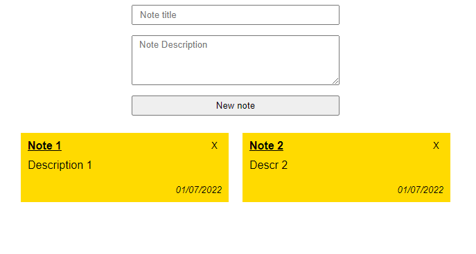

#### Пример работы

---
#### Запуск приложения
Запуск выполняется с помощью docker
1. Создать файл `.env`, скопировав переменные из `.env.example`. Заполнить данные переменные в `.env` файле
2. Перейти в папку, содержащую Dockerfile
3. Выполнить `docker-compose up --build`
4. `docker exec -it <app container id> bash`
5. `composer install`
6. Перейти к `http://localhost:8000`